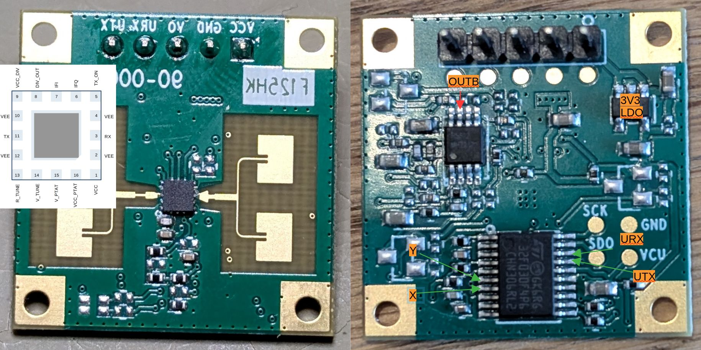
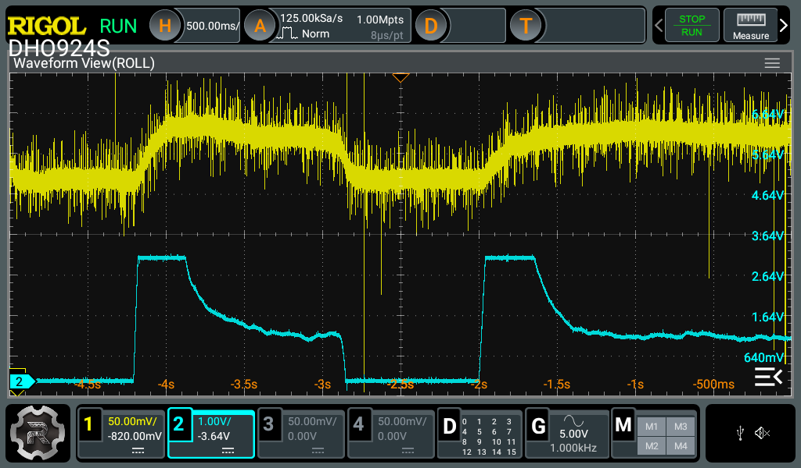
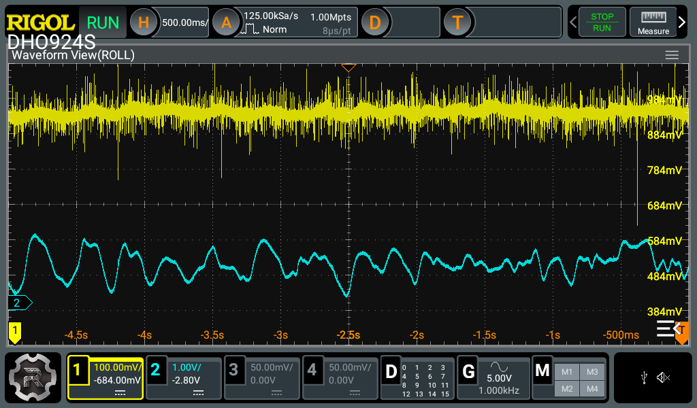

## Reverse Engineering the Hi-Link LD1115H

The LD1115H is a 24GHz CW radar for human presense and object movement detection. 

It uses our old friend SGRSemi SRK1101/SGR1101A and a STM32F030 microcontroller.

Rather boring hardware. Not spending any further time here.

## Hardware

### Picture of the PCB



### ICs

- Controller: ST STM32F030f4
- OpAmp: Runic RS622S
- Radar: SGRSemi SGR1101A
- LDO: GU5R1 (noname 3V3 LDO)


### Measurements X and Y

Wild educated guesses here. Not 100% sure.

Both signal captured from OpAmp output vs. their ADC signal on the STM32.

#### X: Derviate of the filtered  echo  signal




#### Y: Bandpassed (no DC offset) echo signal



## Firmware

SDO/SCK are exposed an labeled. No read protection is set.

### Firmware

```
 - Found SW-DP with ID 0x0BB11477
 - DPIDR: 0x0BB11477
 - CoreSight SoC-400 or earlier
 - Scanning AP map to find all available APs
 - AP[1]: Stopped AP scan as end of AP map has been reached
 - AP[0]: AHB-AP (IDR: 0x04770021, ADDR: 0x00000000)
 - Iterating through AP map to find AHB-AP to use
 - AP[0]: Core found
 - AP[0]: AHB-AP ROM base: 0xE00FF000
 - CPUID register: 0x410CC200. Implementer code: 0x41 (ARM)
 - Found Cortex-M0 r0p0, Little endian.
 - FPUnit: 4 code (BP) slots and 0 literal slots
 - CoreSight components:
 - ROMTbl[0] @ E00FF000
 - [0][0]: E000E000 CID B105E00D PID 000BB008 SCS
 - [0][1]: E0001000 CID B105E00D PID 000BB00A DWT
 - [0][2]: E0002000 CID B105E00D PID 000BB00B FPB
 - Executing init sequence ...
  - Initialized successfully
 - Target interface speed: 4000 kHz (Fixed)
 - Found 1 JTAG device. Core ID: 0x0BB11477 (None)
 - Connected successfully
```

```
# ls -alh ld1115h.bin 
-rw-r--r-- 1 # # 16K Feb 14 19:18 ld1115h.bin

# sha256sum ld1115h.bin 
2b00ed5e20f7e4a64959642cc5f4a712991297a8e9d092b6c3bb9996141da3d1  ld1115h.bin
```

```
# strings ld1115h.bin

(...)
Amov raw data is: *********************
occ raw data is: $$$$$$$$$$$$$$$$$$$$$$
%d %d
 %d %d

(...)

j:O9pAj:J
Ak8K

(...)

Al6NH01

(...)

 mov, %d %d
null
occ, %d %d

(...)

 th1=
 th1 is %d
th2=
 th2 is %d
th3=
 th3 is %d
th_in=
 th_in is %d
ind_min_mov=
 ind_min_mov is %d
ind_min_occ=
 ind_min_occ is %d
ind_max=
 ind_max is %d
mnum=
 mnum is %d
test_mode=
 test_mode is %d
output_mode=
 output_mode is %d
tons=
 tons is %d
utons=
utons is %d
tn1=
 tn1 is %d
tn2=
 tn2 is %d
tn3=
 tn3 is %d
tn4=
 tn4 is %d
tn5=
 tn5 is %d
tn6=
 tn6 is %d
tn7=
 tn7 is %d
data_obt=
 data_obt is %d
get_all

(...)

sgr_get_all
initial
all vars have been initialled
RKB1155H V2.4 20220801
save
all vars have been saved

(...)

occ, %d %d $$$$

(...)

flash write failed6
flash wirte failed1
flash wirte failed2
```